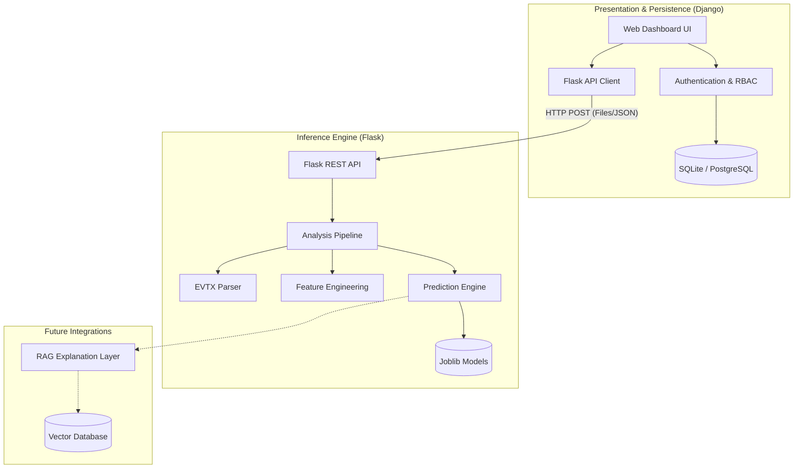
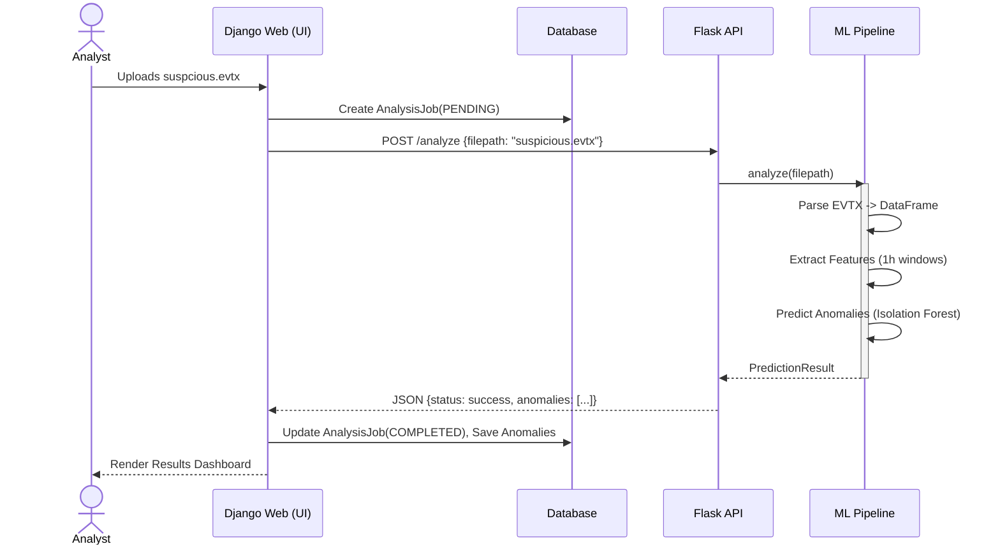

# System Architecture

This document details the overarching architecture of the Log File Anomaly Detector, focusing on the separation of concerns, communication flows, and system layers.

---

## 🏗️ Overall Layered Architecture

The system is built on a **Decoupled Hybrid Microservice Architecture**, separating the heavy computational data science workload from the user-facing web presentation layer.

---

## 🔄 Communication Flow & Request Lifecycle

When a SOC Analyst uploads a log file for analysis, the system follows this request lifecycle:

1. **Upload Initiation**: User authenticates via Django and uploads a `.evtx` file via the web dashboard.
2. **Django Handling**: Django saves the file to a secure `media/` directory and creates an `AnalysisJob` database record with status `PENDING`.
3. **API Invocation**: The Django `FlaskAPIClient` (`services.py`) makes a synchronous HTTP POST request to the Flask `/analyze` endpoint, passing the absolute path to the `.evtx` file.
4. **Flask Orchestration**:
   - Flask receives the request and invokes `AnalysisPipeline.analyze()`.
   - **Parser Layer**: `EVTXFileParser` reads the binary file and extracts XML into a Pandas DataFrame.
   - **Feature Engineering Layer**: `EventFeatureBuilder` aggregates the raw events into 1-hour time windows and computes 15 numerical features.
   - **Machine Learning Layer**: `AnomalyPredictor` loads the persisted `scaler.joblib` and `isolation_model.joblib`, scales the features, and predicts anomalies.
5. **API Response**: Flask serializes the `PredictionResult` (including summary stats and anomaly lists) into JSON and returns a `200 OK`.
6. **Django Persistence**: Django parses the JSON, updates the `AnalysisJob` to `COMPLETED`, and saves individual `Anomaly` records to the database.
7. **UI Render**: The user's view refreshes, displaying the parsed dashboard charts and alert tables.

### Sequence Diagram

---

## 🧩 Module Interactions

### The `ml_engine` Package

The ML engine is structured as a cohesive Python package to ensure clean internal boundaries.

- **`config.py`**: Central source of truth for model paths, hyperparameters, and feature definitions. All other modules import from here.
- **`scaler.py`**: Encapsulates `StandardScaler`. Used independently by both `train.py` and `predict.py` to prevent coupling.
- **`pipeline.py`**: The orchestrator. It imports `parser.py`, `feature_engineering.py`, and `predict.py` to chain their operations in memory.

### The `web_dashboard` Application

- **`models.py`**: Defines the relational schema.
- **`views.py`**: Handles HTTP requests from the browser, enforcing RBAC permissions.
- **`services.py`**: Acts as an Anti-Corruption Layer (ACL). It isolates Django from the specific network mechanics of communicating with Flask. If the Flask API changes, only `services.py` needs to be updated, protecting the views.

---

## 🔮 Future Architecture Enhancements

### RAG Integration
The Retrieval-Augmented Generation layer will be introduced as an independent service (or integrated into Flask) that takes high-severity anomalies, queries a Vector Database containing MITRE ATT&CK patterns, and uses an LLM to generate plain-English explanations for the analyst.

### Log Collector / Live Ingestion
While the current system relies on manual file uploads, future architecture iterations will introduce an API endpoint designed to receive streaming JSON logs from Windows Event Forwarding (WEF) or Winlogbeat, bypassing the `EVTXFileParser` and feeding directly into the `analyze_dataframe()` pipeline method.
