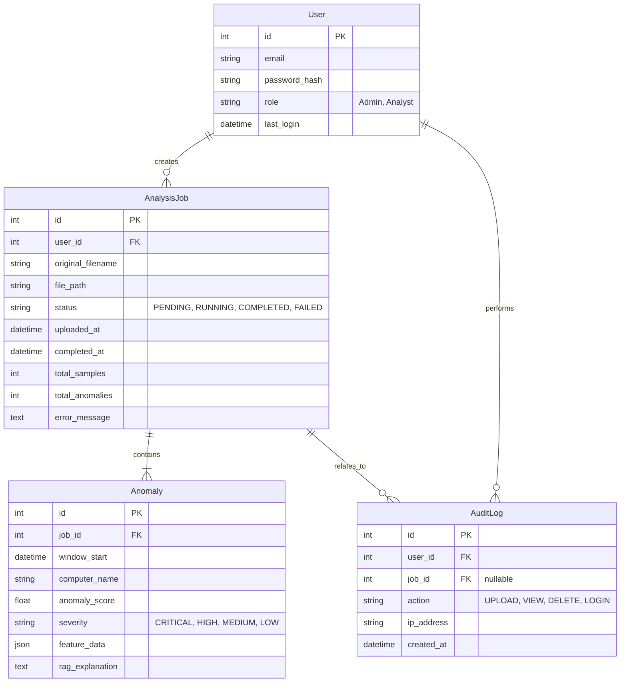

# Database Design

This document outlines the database schema for the Django `web_dashboard` application (Phase 8 implementation). 

> [!NOTE]
> The project currently uses SQLite for development, but the schema is designed using standard Django ORM features to ensure seamless migration to PostgreSQL for production.

---

## 🗺️ Entity Relationship (ER) Diagram

---

## 🗄️ Tables and Constraints

### 1. `AnalysisJob`
Represents a single `.evtx` file uploaded by a user and its processing status.

- **Indexes**: Indexed on `status` (for polling) and `uploaded_at` (for chronological sorting).
- **File Storage**: The `.evtx` file is saved to the Django `MEDIA_ROOT` volume, and the `file_path` column stores the relative path.
- **Status Lifecycle**: `PENDING` -> `RUNNING` -> `COMPLETED` (or `FAILED`).

### 2. `Anomaly`
Stores individual anomalous time windows detected during an AnalysisJob.

- **Relationships**: Foreign Key to `AnalysisJob` (`on_delete=CASCADE`). If a job is deleted, its anomalies are purged.
- **JSONField**: `feature_data` utilizes Django's `models.JSONField` to store the 15 calculated feature values for that window. This prevents creating 15 separate columns and allows flexible future feature additions.
- **Indexes**: Indexed on `severity` and `anomaly_score` to allow fast filtering on the dashboard (e.g., "Show all CRITICAL alerts").

### 3. `AuditLog`
Records all user actions for compliance and accountability.

- **Immutability**: Designed to be append-only. Application logic must not allow editing or deleting audit logs.
- **Relationships**: Foreign Keys to `User` and optionally `AnalysisJob`.

---

## 🚀 Future PostgreSQL Migration Strategy

When transitioning to a production environment:
1. Update `DATABASES` in `settings.py` to use `django.db.backends.postgresql`.
2. Ensure the `psycopg2-binary` requirement is installed.
3. Run `python manage.py migrate`.
4. (Optional) Migrate the `Anomaly.feature_data` JSONField to utilize PostgreSQL's native `JSONB` indexing operators for advanced querying.

---

## 🗑️ Data Retention Strategy

Event logs generate massive amounts of data. To prevent database bloat:
- **Raw Files**: Scheduled Celery tasks will prune uploaded `.evtx` files in `MEDIA_ROOT` older than 30 days.
- **AnalysisJobs/Anomalies**: Retained for 90 days for historical reporting, then archived or deleted based on organizational compliance requirements.
