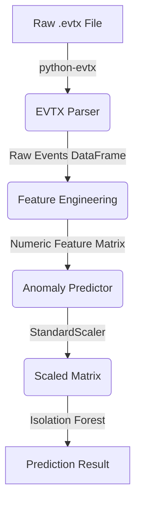

# Machine Learning Pipeline

This document details the Machine Learning pipeline implemented in the `ml_engine` package. It covers the journey from raw binary `.evtx` files to actionable anomaly predictions.

---

## 🏗️ Pipeline Overview

The ML Pipeline is strictly decoupled from the web application. It operates through four distinct phases, which are orchestrated by the `AnalysisPipeline` class (`ml_engine/pipeline.py`) during API requests.

---

## 1. Parser Layer (`parser.py`)

**Purpose**: Convert binary Windows XML Event Log (`.evtx`) files into structured, flat data.

- **Technology**: Utilizes `python-evtx` to parse the binary format into XML, followed by standard XML parsing to extract fields.
- **Normalization**: Extracts `EventID`, `TimeCreated`, `Computer`, `Channel`, and specific `EventData` attributes (like TargetUserName or ProcessName).
- **Output**: A Pandas DataFrame where each row represents a single log event.

---

## 2. Feature Engineering Layer (`feature_engineering.py`)

**Purpose**: Transform categorical and unstructured event logs into a numeric matrix suitable for Machine Learning models.

- **Time Windowing**: The pipeline groups raw events into discrete time windows (default is 1-hour intervals). Anomaly detection relies on analyzing behavior over time rather than examining single, isolated events.
- **Feature Extraction**: Calculates 15 specific numerical features per window based on established MITRE ATT&CK indicators.

### Extracted Features List

| Feature | Description | MITRE Tactic |
|---------|-------------|--------------|
| `total_events` | Volume of logs in the window | Baseline |
| `failed_logins` | Count of Event ID 4625 | Credential Access |
| `successful_logins` | Count of Event ID 4624 | Baseline |
| `admin_events` | Usage of privileged accounts/groups | Privilege Escalation |
| `process_creation_events` | Count of Event ID 4688 | Execution |
| `new_user_events` | Count of Event IDs 4720 | Persistence |
| `service_install_events`| Count of Event ID 7045 | Persistence |
| `group_membership_changes`| Event IDs modifying groups | Privilege Escalation |
| `audit_log_clears` | Count of Event IDs 1102, 104 | Defense Evasion |
| `unique_users` | Count of distinct user accounts seen | Lateral Movement |
| `unique_processes` | Count of distinct executables run | Execution |
| `unique_ips` | Count of distinct remote IPs | Command & Control |
| `failure_rate` | `failed_logins` / (`successful_logins` + `failed_logins`) | Credential Access |
| `admin_ratio` | `admin_events` / `total_events` | Privilege Escalation |
| `process_ratio` | `process_creation_events` / `total_events` | Execution |

---

## 3. Training Workflow (`train.py`)

**Purpose**: Fit the unsupervised Isolation Forest model on a baseline dataset.

- **Model**: `sklearn.ensemble.IsolationForest`.
- **Scaling**: A `StandardScaler` (wrapped in `FeatureScaler` via `scaler.py`) is fitted on the training data to normalize all 15 features to a mean of 0 and variance of 1. This is critical for distance-based anomaly detection.
- **Artifact Persistence**: Both the model and the fitted scaler are saved to `ml_engine/models/` using `joblib`.
- **Note**: Training is currently a batch process executed manually via CLI (`python -m ml_engine.train`).

---

## 4. Prediction Workflow (`predict.py`)

**Purpose**: Score new, unseen log windows for anomalies.

- **Artifact Loading**: `AnomalyPredictor` loads the pre-trained `isolation_model.joblib` and the exact `scaler.joblib` created during training.
- **Strict Separation**: The prediction engine *never* fits the scaler on new data. It only calls `.transform()`. This ensures that incoming data is scaled relative to the training baseline.
- **Scoring**: Calculates anomaly scores using the model's `decision_function`.
- **Severity Mapping**:
  - `CRITICAL`: Score < -0.15
  - `HIGH`: Score between -0.15 and -0.10
  - `MEDIUM`: Score between -0.10 and 0.0 (where 0.0 is the model's contamination threshold)
  - `LOW`: Score > 0.0 (Considered Normal)

---

## Current Limitations & Future Improvements

1. **Static Baseline**: The model currently requires manual retraining as network baselines drift over time.
   - *Future*: Implement an automated feedback loop where analysts marking false positives triggers an incremental retrain or adjusts thresholds.
2. **Context Blindness**: The ML model only looks at numerical frequencies; it loses the semantic context (e.g., *which* specific user failed to login 50 times).
   - *Future*: This limitation is specifically addressed by the planned Retrieval-Augmented Generation (RAG) layer, which will cross-reference the anomalous timestamps with the raw logs to restore context.
3. **Window Granularity**: The 1-hour window might miss "low and slow" attacks that occur over days, or fast attacks occurring in seconds.
   - *Future*: Multi-window feature extraction (e.g., 5-minute, 1-hour, and 24-hour rolling windows).
