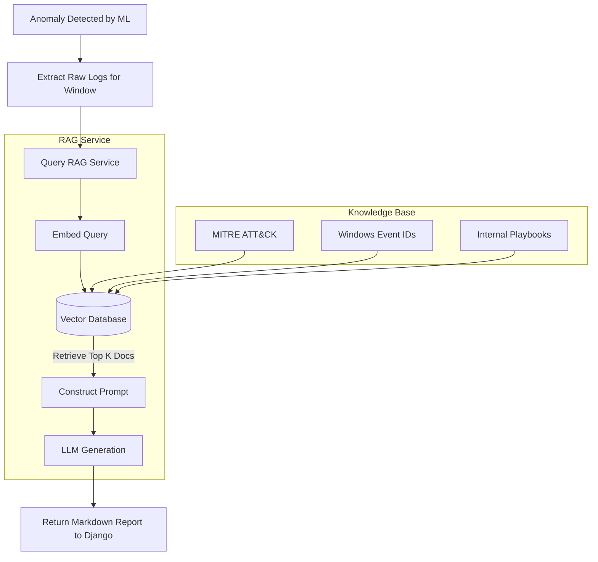

# Retrieval-Augmented Generation (RAG) Design

> [!WARNING]
> This document describes the **future architecture** for the RAG explanation layer. This feature is currently in the design phase and is **not yet implemented**.

---

## 🎯 Purpose

The primary limitation of numerical anomaly detection (like Isolation Forest) is that it flags *when* something is anomalous, but struggles to explain *why* in human-readable terms.

The RAG layer acts as a virtual Tier 2 SOC Analyst. When the `ml_engine` detects a High or Critical anomaly, the system will use an LLM (Large Language Model) augmented by a specialized cybersecurity Knowledge Base (KB) to analyze the raw logs from that time window and generate an incident explanation, mapping the behavior to MITRE ATT&CK tactics.

---

## 🏗️ Architecture



---

## 🧩 Components

### 1. Vector Database
- **Role**: Store and perform similarity searches on chunked cybersecurity documentation.
- **Planned Technology**: ChromaDB or Qdrant (capable of running locally without heavy infrastructure).

### 2. Embedding Model
- **Role**: Convert text into dense vector representations.
- **Planned Technology**: `sentence-transformers/all-MiniLM-L6-v2` (fast, runs on CPU).

### 3. LLM
- **Role**: Generate the final explanation by reasoning over the retrieved context.
- **Planned Technology**: OpenAI (GPT-4) or a local Ollama instance (Llama 3 / Mistral) depending on data privacy requirements.

---

## 📚 Knowledge Collections

The Vector DB will be populated with three distinct collections:

1. **Windows Event ID References**:
   - Detailed explanations of what specific Event IDs mean (e.g., 4624, 4688, 7045).
   - Expected normal behavior vs. malicious indicators.
2. **MITRE ATT&CK Framework**:
   - Tactics, Techniques, and Procedures (TTPs).
   - Mapping specific log sequences to known threat actor behaviors.
3. **Internal SOC Playbooks**:
   - (Optional) Organization-specific incident response guidelines.

---

## 🔄 Retrieval Workflow

1. **Trigger**: AnomalyPredictor outputs a score < -0.10 (High/Critical).
2. **Query Formulation**: The system extracts the top contributing features (e.g., high `failed_logins` and `process_creation_events`) and fetches the corresponding raw `EventID` logs for that hour.
3. **Retrieval**: The system queries the Vector DB: *"What MITRE techniques involve Event ID 4625 followed by 4688?"*
4. **Prompt Assembly**: The retrieved documents are injected into the LLM prompt alongside the raw log data.
5. **Generation**: The LLM generates a structured Markdown report.

### Example Prompt Template

```text
You are an expert SOC Analyst. Analyze the following Windows Event Logs flagged as anomalous by our ML model.

RAW LOGS (Time Window: {timestamp}):
{raw_logs}

KNOWLEDGE BASE CONTEXT:
{retrieved_documents}

Task:
1. Identify the likely attack vector based on the MITRE ATT&CK framework.
2. Explain why this sequence of events is highly anomalous.
3. Recommend immediate remediation steps.
```
