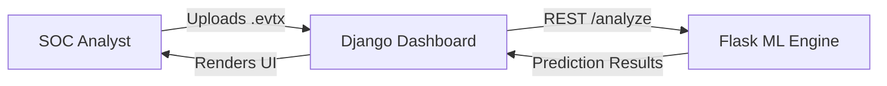

# AI-Based Windows Event Log Anomaly Detection System


An enterprise-grade Security Operations Center (SOC) platform designed to detect anomalous behavior in Windows Event Logs (`.evtx`). The system uses a hybrid architecture, combining a Flask-based Machine Learning microservice for log parsing and anomaly detection (via Isolation Forest) with a Django-based web dashboard for user management, log uploading, and alerting.


---

## 🚀 Features

- **EVTX Parsing**: Robust parsing of Windows Event Logs into structured data.
- **Feature Engineering**: Automated extraction of security-relevant features across 10 MITRE ATT&CK tactics (e.g., failed logins, process creation anomalies, audit log clears).
- **Machine Learning Detection**: Unsupervised anomaly detection using `scikit-learn`'s Isolation Forest.
- **Scalable Architecture**: Strict decoupling between the ML inference engine (Flask) and the web presentation layer (Django).
- **Futuristic Scope**: Retrieval-Augmented Generation (RAG) explanation layer to provide LLM-driven incident context.

---

## 🏛️ Architecture Overview

The project is structured as a decoupled microservices architecture:

1. **`ml_engine` (Flask)**: A standalone Python package responsible for parsing logs, building feature matrices, and running the ML models.
2. **`web_dashboard` (Django)**: The SOC user interface. Handles user authentication, log file uploads, database persistence, and communicates with the `ml_engine` via a REST API.




---

## 📂 Folder Structure

```text
Log-File-Anomaly-Detector/
├── data/                  # Data directories (raw_logs, processed)
├── ml_engine/             # ML & Inference Microservice (Flask)
│   ├── models/            # Persisted Joblib models
│   ├── config.py          # Central ML configuration
│   ├── pipeline.py        # End-to-end analysis orchestrator
│   └── ...                # Parser, Feature Engineering, Training, Predict
├── web_dashboard/         # SOC Dashboard (Django)
│   ├── dashboard/         # Main Django app (Views, Models, UI)
│   └── web_dashboard/     # Django project settings
├── scripts/               # Utility scripts (e.g., dataset generation)
└── requirements.txt       # Unified Python dependencies
```

---

## 🛠️ Technology Stack

- **Backend Web Frameworks**: Django 5.0, Flask 3.0
- **Machine Learning**: scikit-learn (Isolation Forest), Pandas, NumPy, Joblib
- **Data Parsing**: python-evtx
- **Database**: SQLite (Development), PostgreSQL (Future Production)
- **Frontend**: Django Templates, Bootstrap 5, Chart.js

---

## ⚡ Quick Start

### Prerequisites
- Python 3.10+
- `pip` and `virtualenv`

### Installation

1. **Clone the repository**:
   ```bash
   git clone https://github.com/your-org/Log-File-Anomaly-Detector.git
   cd Log-File-Anomaly-Detector
   ```

2. **Set up the virtual environment**:
   ```bash
   python -m venv .venv
   # Windows:
   .venv\Scripts\activate
   # Linux/Mac:
   source .venv/bin/activate
   ```

3. **Install dependencies**:
   ```bash
   pip install -r requirements.txt
   ```

4. **Environment Variables**:
   Copy the example config:
   ```bash
   cp .env.example .env
   ```

### Running the System (Development)

Currently, the ML engine can be run as a standalone package (Phase 7A complete).

**Test the ML Pipeline**:
```bash
# Parse -> Extract Features -> Predict on sample data
python -m ml_engine.pipeline
```

*(Instructions for running the Flask API and Django Dashboard will be added in Phases 7B and 8)*.

---

## 🗺️ Current Status & Roadmap

- ✅ **Phases 1-12**: Complete. The core ML pipeline (Parsing, Feature Engineering, Training, Prediction) and full Django web dashboard (Authentication, RBAC, Upload workflow, Alerts, Analytics) are fully implemented.
- 🔜 **Futuristic Scope**:
  - Phases 13-14: RAG Knowledge Base and Explanation Layer
  - Phase 15: Automated Reporting
  - Phase 16: Admin & Settings
  - Phase 17: Deployment Infrastructure (Docker, PostgreSQL, Nginx)


---

## 📄 License

This project is licensed under the MIT License - see the LICENSE file for details.

## 🙏 Acknowledgements

- Built for modern Security Operations Centers.
- Uses `python-evtx` for robust Windows Event Log parsing.
- Inspired by MITRE ATT&CK framework event mappings.
